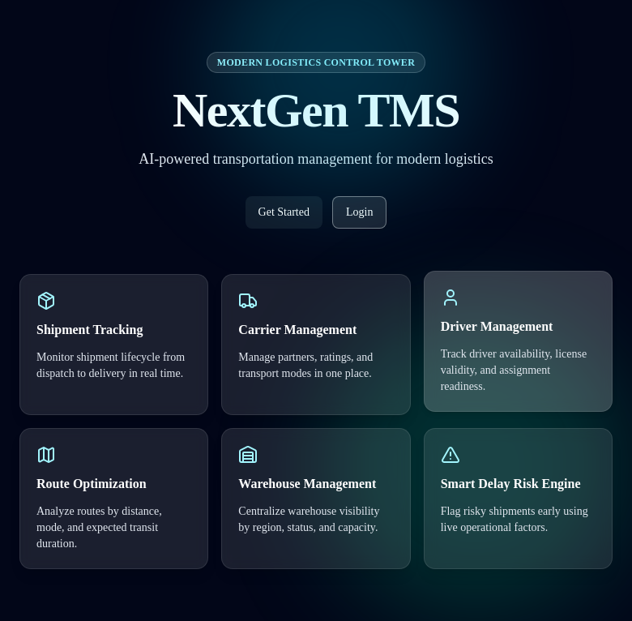
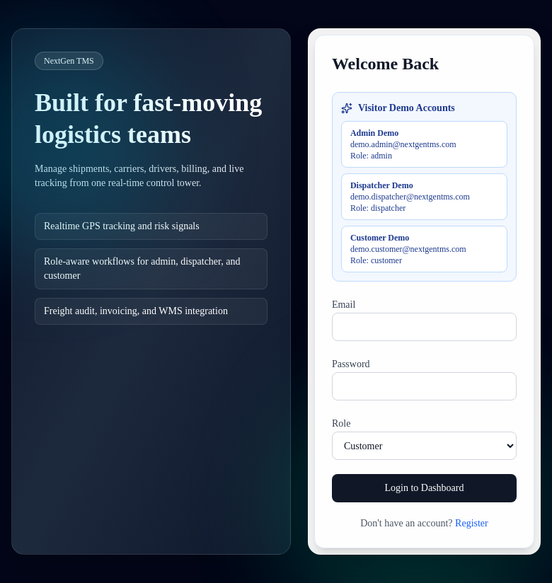
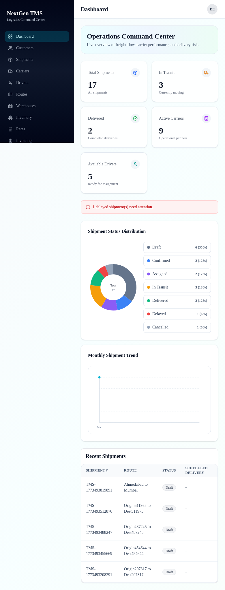
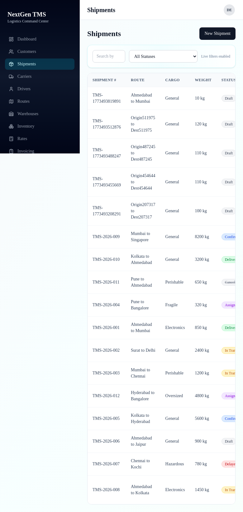
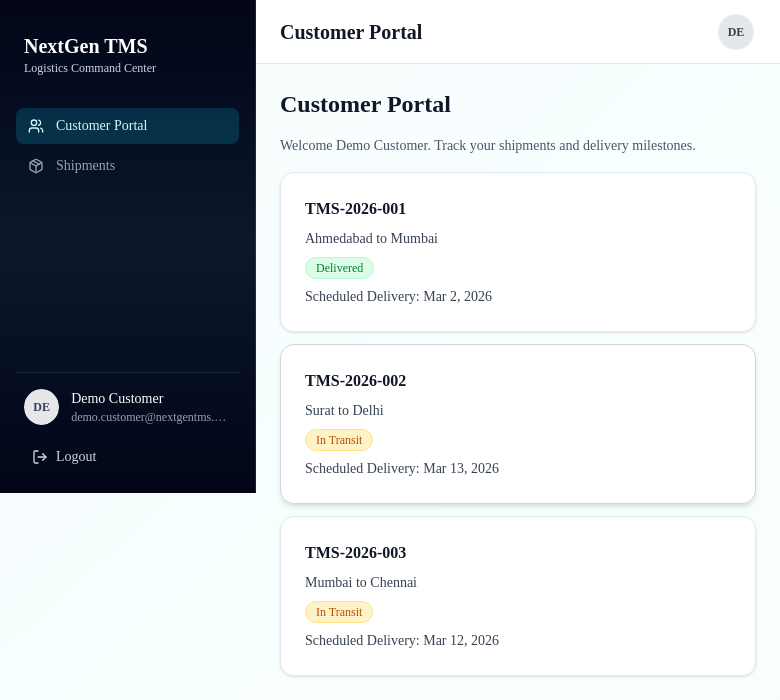
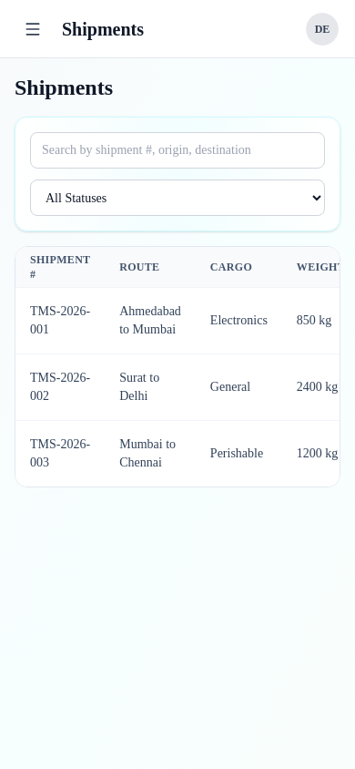

# NextGen TMS Platform

AI-powered Transportation Management System for logistics operations.

## Overview

NextGen TMS helps teams manage the full shipment lifecycle:

Order -> Shipment -> Carrier/Driver Assignment -> Tracking -> Delivery -> Audit/Reporting

Core capabilities include:

- Role-based access (Admin, Dispatcher, Customer)
- Shipment creation, filtering, and detail workflows
- Carrier, driver, route, and warehouse operations
- Customer portal for shipment visibility
- Delay risk engine, reporting dashboard, and workflow extensions

## Tech Stack

- Next.js 16 (App Router), TypeScript, Tailwind CSS, shadcn/ui
- Supabase (Auth + PostgreSQL)
- Vercel deployment

## Demo Access

- Admin: `demo.admin@nextgentms.com` / `Admin@12345`
- Dispatcher: `demo.dispatcher@nextgentms.com` / `Dispatch@12345`
- Customer: `demo.customer@nextgentms.com` / `Customer@12345`

## Screenshots

### 1. Landing Page
The public marketing page introduces the product value and key modules.



### 2. Login Experience
Role-aware login with quick-fill visitor demo accounts.



### 3. Admin Dashboard
Operations command center with KPI cards, shipment status distribution, trend chart, and recent shipments.



### 4. Shipments Module
Shipment workspace with live filters, status badges, and actionable listing rows.



### 5. Customer Portal
Customer-only view showing only the customer’s own shipments and milestones.



### 6. Mobile Responsive View
Mobile layout of shipments page with responsive header and filter controls.



## Run Locally

```bash
npm install
npm run dev
```

Then open `http://localhost:3000`.

## Production

Live app: `https://nextgen-tms-platform.vercel.app`
